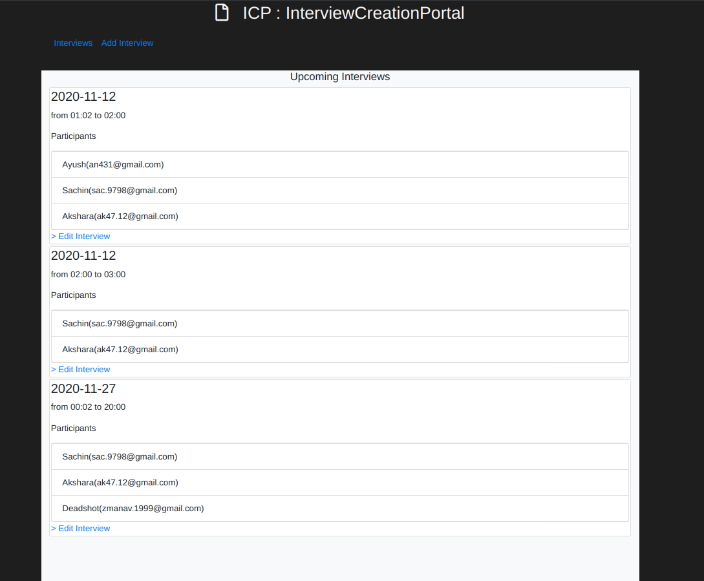

<h1 align="center">ICP</h1>
<h4 align="center">Interview Creation Portal</h4>
<p>

<h1 align="center">Welcome to icp 👋</h1>
<p>
  <a href="https://www.npmjs.com/package/icp" target="_blank">
    
  </a>
</p>

## About

ICP is a minimum viable product for the Interview Schudling Task.

### Installing Dependencies

To install Dependencies run

```sh
npm i
```

### Settings up Environment variables 

To setup the environment variables you have to create a .env file, for your Gmail(or any other mailing service) in order to facilitate successful Email respectively, as shown below

```sh
# nodemailer credetials

NODEMAILER_EMAIL=
NODEMAILER_PASS=
```

## Usage
```sh
npm run start
```

## Gallery

Snapshots of project.


|*Upcoming Interviews*|


|*Add Interview Page*|

|*Email sent to Partipants*|


## Show your support

Give a ⭐️ if this project helped you!
